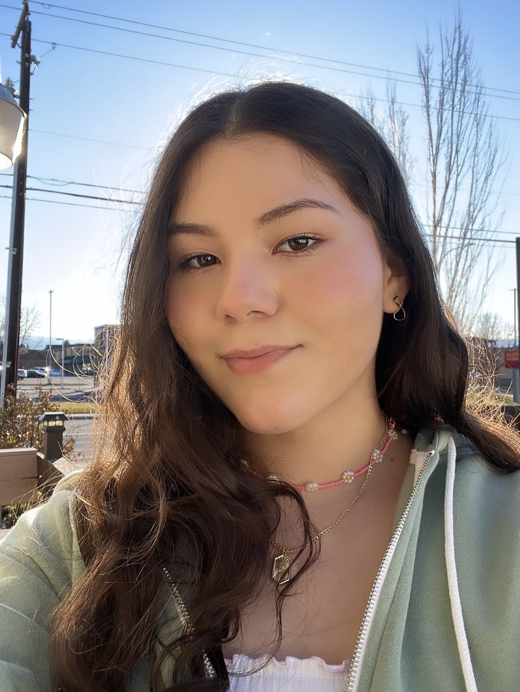
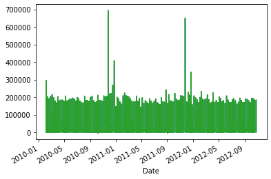
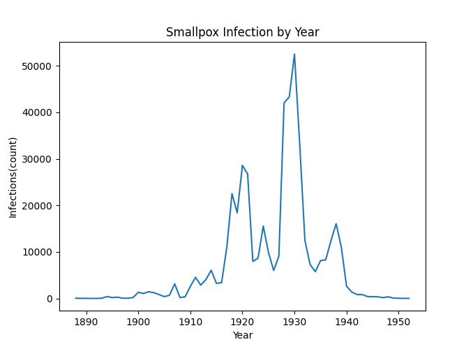
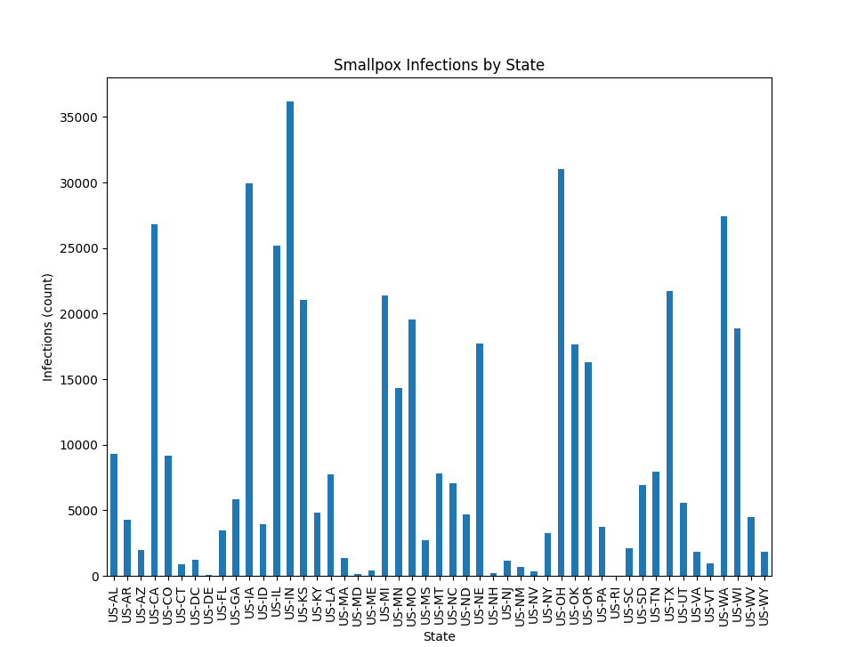

### Check out my potfolio. 
In this document I'm going to be talking a little about me, my hobbies, school experience, and some projects I've worked on.

# Hi, it's Evelyn! 
## Cumpter Science student

## About Me

My name is Evelyn Barajas and I'm a junior at Heritage University majoring in Computer Science. I enjoy coding, I think is something fun and a very useful skill. I always like to learn new things and try to keep up with all the new information I learn in my classes. I've always been interested in technology and how compuetrs work which is why I was drawn to Computer Science.

### Hobbies

Some of my hobbies are: 
* drawing  
* hiking 
* practice coding
* listening to music 
* and hanging out with friends

## Educational Experience

**Associate's in Computer Science** Yakima Valley College.

*Graduated in 2022*

**B.S. Computer Science** Heritage University.

*In progress*

## Projects

[Machine Learning with Time Series Data](https://colab.research.google.com/drive/1LOK0fIyfCzOs6xsucTevoavBp1ql96Qq?usp=share_link)

Builds a multivariate recurrent neural network (RNN-LSTM) to predict the weekly sales of a retail store based on other features.

[Pandas Data](https://github.com/EvelynBarajas/EvelynBarajas.github.io/blob/main/pandasData.py)

Data manipulation using Pandas.

[Data Manipulation](https://github.com/EvelynBarajas/EvelynBarajas.github.io/blob/main/homework3.py)

Data manipulation from a .csv file using Pandas, and creatiing figures using matplotlib.pyplot.

[Tic Tac Toe Game](/TicTacToe.html) 

XOs game using HTML, JavaScript, CSS.

## Contact Me

<label for="email">Email:</label> 
<input type="email" id="email" name="_replyto" placeholder="Enter your email" required> 
<label for="message">Comments:</label>
<textarea id="message" name="message" placeholder="Enter your message" required></textarea> 

<input type="submit" value="Send">

